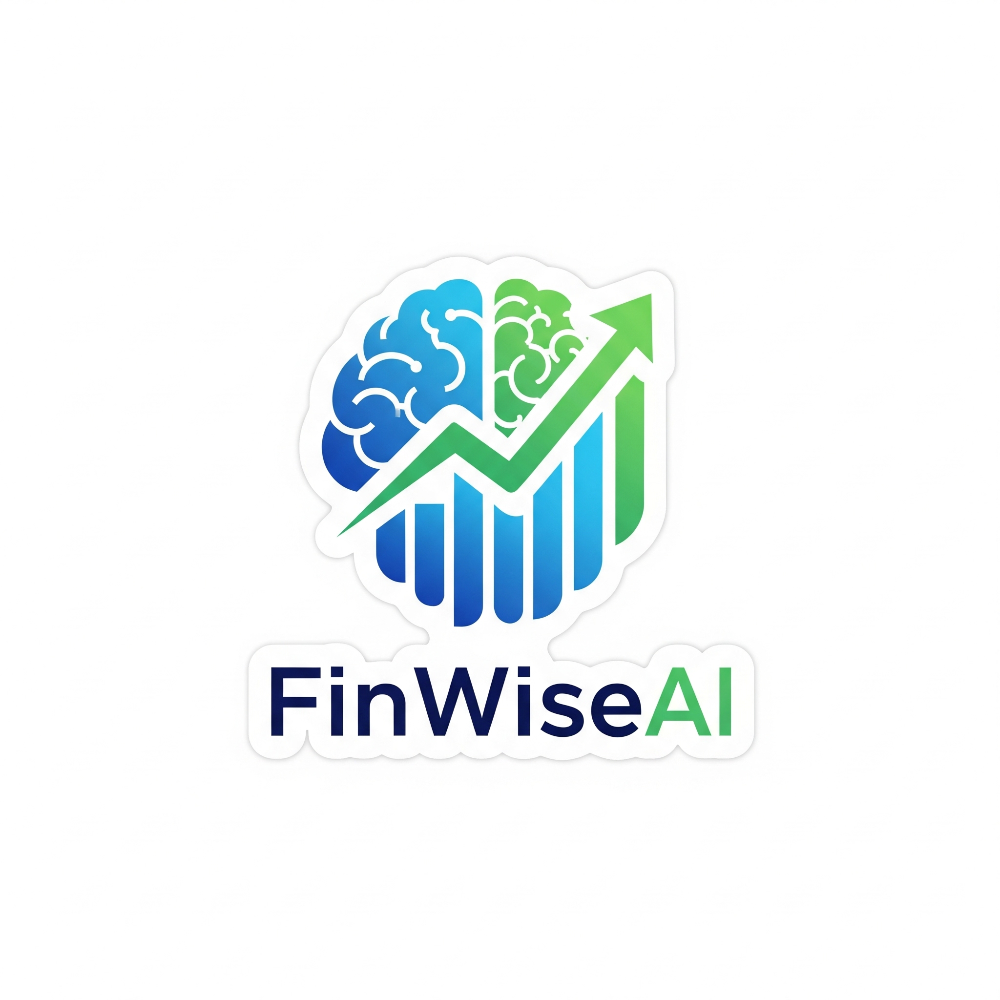

<p align="center">
  
</p>

<h1 align="center">💸 FinWiseAI – AI Financial Coach Powered by Google ADK</h1>

<p align="center">
 FinWiseAI is a multi-agent, AI-powered financial advisor built with Google's Agent Development Kit (ADK) and Gemini AI. This interactive Streamlit application delivers intelligent, personalized insights for budgeting, saving, and debt management designed for individuals seeking actionable financial guidance.
</p>


## 🚀 Key Features

### 🤖 Multi-Agent Architecture

Leverages Google's ADK to orchestrate a pipeline of intelligent agents:

- **🔍 Budget Analysis Agent**  
  Identifies spending patterns, highlights inefficiencies, and provides cost-saving recommendations.

- **💰 Savings Strategy Agent**  
  Calculates optimal emergency fund targets, allocates savings by goal, and suggests automation techniques for consistency.

- **💳 Debt Reduction Agent**  
  Develops data-driven payoff strategies using both **avalanche** and **snowball** methods, supported by impact analysis and timelines.

---

### 📊 Advanced Financial Analysis

- **Flexible Expense Input**  
  Upload expenses via CSV or enter them manually through the UI.

- **Dynamic Data Visualization**  
  - Category-wise spending pie charts  
  - Income vs. Expense bar comparisons  
  - Debt balance vs. interest savings plots  
  - Real-time progress tracking metrics

- **Smart Recommendations**  
  - Goal-driven savings advice  
  - Emergency fund planning  
  - Debt consolidation opportunities  
  - Behavior-based budget optimization

- **User Privacy & Security**  
  - All data is processed locally  
  - No financial data is stored or transmitted externally  
  - API communications are secured using `.env` secrets

---

## 🛠️ Setup & Execution

### 1. 🔐 Get Your Gemini API Key

- Sign in to [Google AI Studio](https://aistudio.google.com/apikey)
- Create a `.env` file in the root directory and add your key:

```env
GOOGLE_API_KEY=your_api_key_here

2. **Clone the Repository**:
   ```bash
      git clone https://github.com/ShreyasGosavi404/FinWiseAI.git
      cd FinWiseAI

   ```

3. **Install Dependencies**:
   ```bash
   pip install -r requirements.txt
   ```

4. **Run the Streamlit App**:
   ```bash
   streamlit run ai_financial_coach_agent.py
   ```

## CSV File Format

The application accepts CSV files with the following required columns:
- `Date`: Transaction date in YYYY-MM-DD format
- `Category`: Expense category
- `Amount`: Transaction amount (supports currency symbols and comma formatting)

Example:
```csv
Date,Category,Amount
2024-01-01,Housing,1200.00
2024-01-02,Food,150.50
2024-01-03,Transportation,45.00
```

A template CSV file can be downloaded directly from the application's sidebar.


## 🧠 Powered By

- [Google ADK](https://developers.google.com/agent-development-kit)
- [Gemini AI](https://deepmind.google/technologies/gemini/)
- [Streamlit](https://streamlit.io/)
- [Plotly](https://plotly.com/python/)

---

## 📌 License

This project is licensed under the [MIT License](./LICENSE).

---

## 🤝 Contributing

Contributions are welcome!  
If you have ideas, improvements, or feature requests, please [open an issue](https://github.com/ShreyasGosavi404/FinWiseAI/issues) or submit a pull request.

